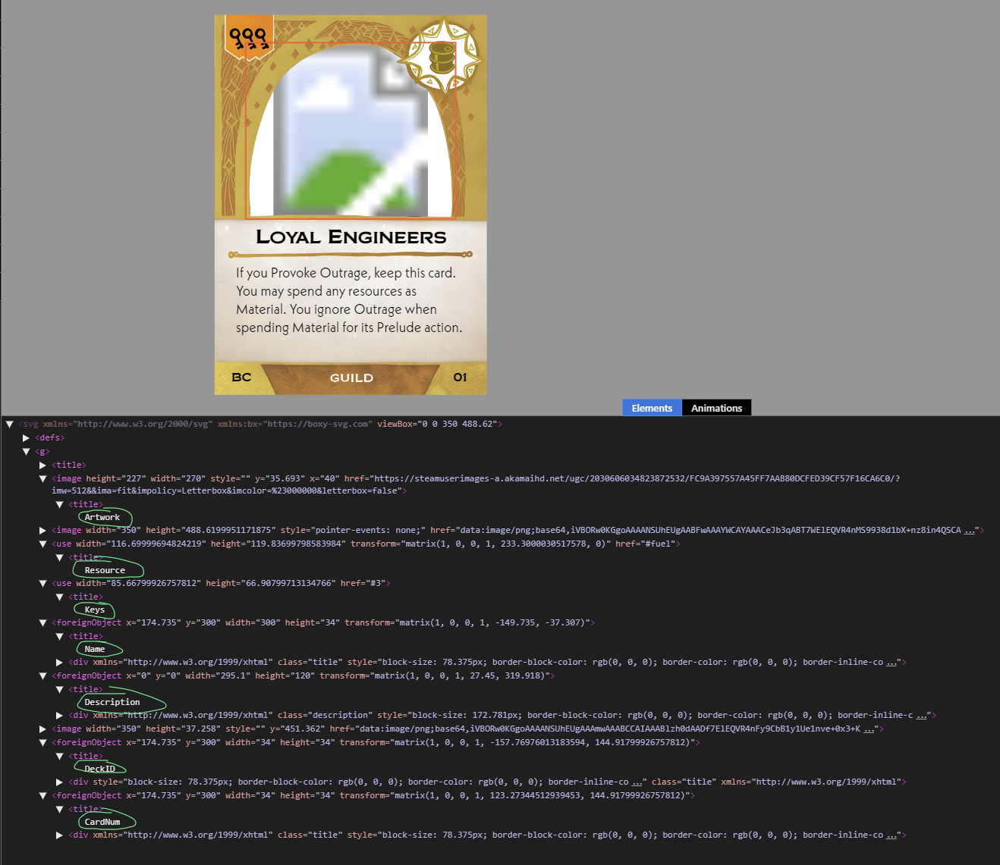

# Card Generator:
This is a generalized tool that can be used to generate cards for tabletop games. It has no GUI and instead relies on users to define a set of assets that are fed into the generator.

## CardList.xlsx
This file is the main input file users can edit to generate new cards. CardLists.xlsx has one sheet named after each template in the assets directory. asside from the first row - which is a set of column names - each row represents one card. Users can add cards by filling out the info on a new row. You'll note that the info required is different depending on the template. This is because the template determines which fields are required to successfully generate a card.

## Templates:
There a few templates pre-included in the generator's asset folder. They all have a .svg file type. If you don't have an svg editor, you can still view the templates by opening them in chrome. You can of course edit or make new templates but please note: they are fragile. There's elements of the assets that utilize <foreignObject> flags to help support text wrapping which may not render or be editable in your svg editor. When creating a template, you must also add a sheet to the CardList.xlsx and define the fields necessary to generate your card. 

note: For non-text based fields where there's a limited set of available options, it's customary to define a dropdown in Excel (or LebreOffice Calc) to ensure that you don't input a value that's undefined

### Template Fields:
The names of the fields being referenced in the xlsx file coencide with the names of elements in the svg. 

Note that while every column in CardList.xlsx coresponds with the name of an element in the svg, not every named element in the svg is required to be a field in the CardList.xlsx.

These fields can work in several different ways depending on how they're set up in the svg:

### Text Based Fields:
These fields are used when you want to allow users to write text in the CardList.xlsx file and place that in a textbox on the template card. If you don't care about word wrapping, you can simply create an svg text element and name it after the field. Then, any text written by the user in that field, will replace the text in the template element. If you do want word wrapping, you'll need to use a foreign object. My suggestion is to copy an existing template that does this. You'll likely need to edit the svg by text to format the textboxes properly because most editors don't support foreign objects.

### Image based Fields:
These fields are used when you want to allow users to replace an image with one a url in the CardList.xlsx file. For this, simply name an image element after the field.

### Symbol Fields:
This is the most complicated but also the most powerful field type. You can read about svg symbols [here](https://developer.mozilla.org/en-US/docs/Web/SVG/Element/symbol). Defining a set of named symbols and then adding one of them to the template, allows you to create a field that can be hotswapped out for any of the other symbols. For example, if your card has a resource icon, you can make a symbol for each resource, add one to your template, name it "resource" and then add a field to the CardList.xlsx also named "resource". Users can then put the name of their card's resource and so long as it matches a symbol you defined, the resource symbol will appear on the generated card.

